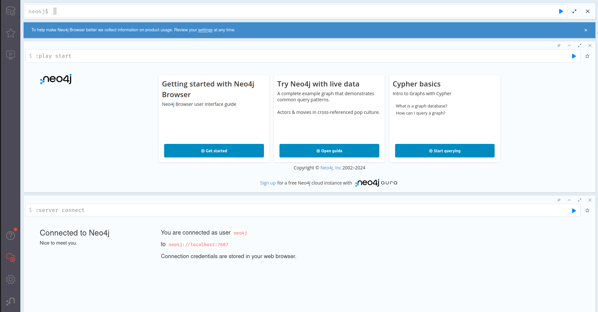
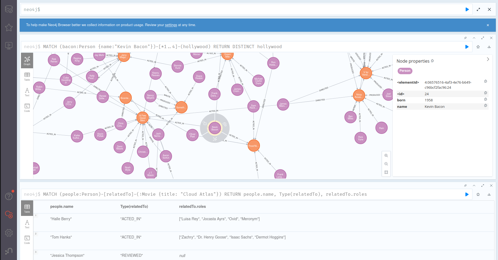

# vagrant_poc
Dummy repo to play around with Vagrant and Ansible. 

Deploys an Ubuntu 22.04 VM and configures a Neo4J server.

Following deploy, you may connect to the Neo4J instance from your browser at `http://ocalhost:7474` and begin to issue queries, explore data, etc.

Use the credentials to log in:

    username: neo4j
    password: password123





## Usage
Install virtual box and vagrant if they are not already installed using 

```bash
bash setup/install_virtualbox_and_vagrant.sh
```

Set up and configure python venv, use pip to install ansible requirements
```bash
python3 -m venv ./venv
source ./venv/bin/activate
pip install -r requirements.txt
```

Change into the vagrant directory and spin up the VM
```bash
cd vagrant
vagrant up
```

After the VM is up you may also SSH into the VM
```bash
vagrant ssh
```

To clean up
```bash
vagrant destroy
```